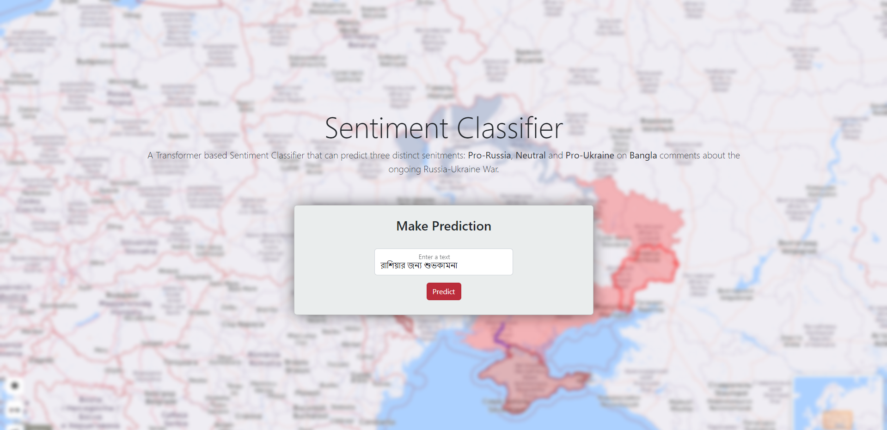
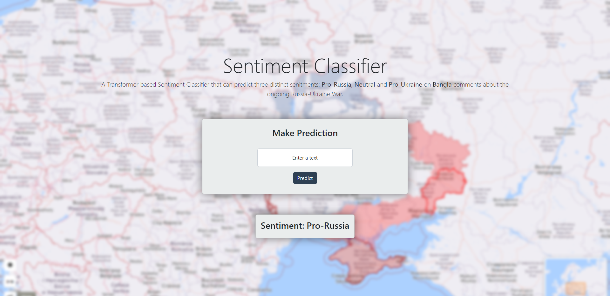

# Deploy Machine Learning Model using Flask

Built a flask app to deploy my sentiment classifier transformer model.
---

Write any comment in **Bangla** about the ongoing Ukraine-Russia war. Based on your comment it will try to predict whether your comment is **Pro-Ukraine**, **Neutral**, or **Pro-Russia** 

    

Here's the prediction.

    

# Installation

Clone this repository. On the terminal, go inside the folder and create a virtual env by using, `python -m venv nameofyourvenv` 

To install the dependencies, run `pip install -r requirements.txt`

# Usage

Open vscode or the terminal and run `flask run`

